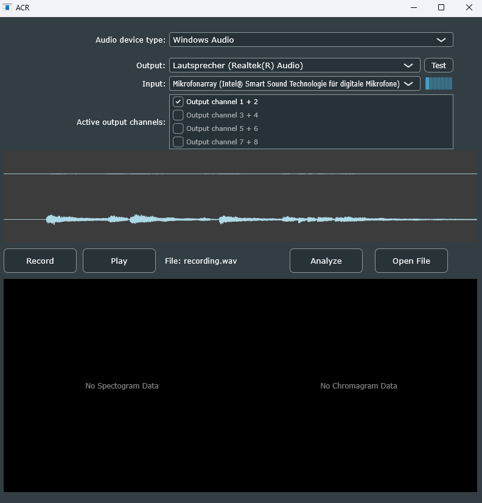

# ACR - Automatic Chord Recognition

This project is a scientific desktop application for Music Information Retrieval (MIR), developed in C++ using the JUCE framework, focused on Automatic Chord Recognition. 

The core objective of the application is the research and implementation of **Deep Chroma Learning**. Currently, a highly optimized, classical DSP pipeline (Harmonic Pitch Class Profiles + Cosine Similarity) serves as a scientific baseline. Throughout the project, this baseline will be extended or replaced by deep learning approaches.

This project is being developed as part of a Bachelor's thesis.

---

## Screenshots

| Start Screen (Recording & Playback) | Analysis View (Spectrogram & Chromagram) |
| :---: | :---: |
|  |  |

---

As seen above there are currently two analysis components. A spectogram of the audio signal, you have to input as a wav-File, and a chromagram, which maps the frequencies to the 12 notes of western music. Both the spectogram and chromagram are clickable, resulting in a full window view.

| Full Spectogram | Full Chromagram |
| :---: | :---: |
|  |  |


## Overall Goal & Architecture

Chord recognition on real-world audio signals (e.g., distorted guitars or polyphonic music) is a highly complex problem due to overtones and inharmonicity. 

This tool orchestrates a complete MIR pipeline:
1. **Audio Engine:** Real-time recording and playback via JUCE.
2. **DSP Backend (Baseline):** 
   - Computation of high-resolution spectrograms (STFT).
   - Extraction of Harmonic Pitch Class Profiles (HPCP) according to E. Gomez.
   - Filtering and smoothing (Median filter, dynamic noise gating).
   - Classification via Cosine Similarity against binary chord templates.
3. **Deep Chroma Learning (Future):** 
   - Planned integration of machine learning (e.g., neural networks) to make chromagrams more robust against noise and overtones, significantly increasing overall accuracy.
4. **Testing Module:** 
   - A decoupled offline testing module for batch processing audio datasets and `.txt` label files (Ground Truth). 
   - Automatic, frame-based evaluation of accuracy and export as an aggregated `JSON` file for evaluation and plotting in Python.

---

## Setup & Installation

This project uses **CMake** as its build system and requires the **JUCE Framework**.

### Prerequisites
* A C++17 capable compiler (MSVC on Windows, Clang on macOS, GCC on Linux)
* [CMake](https://cmake.org/download/) (version 3.22 or higher)

### Build Instructions

1. **Clone the repository:**
   ```bash
   git clone git@github.com:Driemtax/ACR.git
   cd ACR
2. **Adjust JUCE Path:** Open the `CMakeLists.txt` and make sure the path to your local JUCE directory is set correctly: ```add_subdirectory("C:/Your/Path/To/JUCE" JUCE)```
3. **Generate & Build:**
  ```bash
  mkdir build
  cd build
  cmake ..
  cmake --build . --config Release
  ```
*Alternatively, you can open the project directly in IDEs like Visual Studio, CLion, or VS Code (with CMake Tools). The IDE will handle the configuration automatically.*

## Work in Progress (WIP)

As this project is part of an active Bachelor's thesis, it is constantly evolving. When the thesis is finished you can find the full text in this repository. 
Current development focus:
- [x] Setup of the GUI and audio recording logic
- [x] Implementation of the STFT & HPCP baseline
- [x] Automated accuracy tests against Sonic Visualiser labels (JSON export)
- [ ] Integration of Deep Chroma Learning features
- [ ] Optimization of smoothing algorithms (Temporal Smoothing / High-Res Chromagrams)
