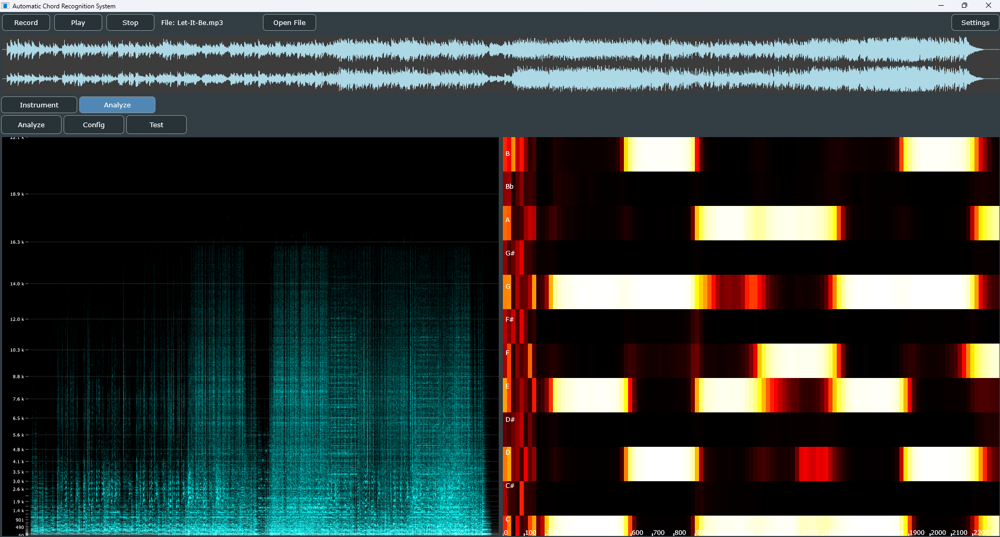
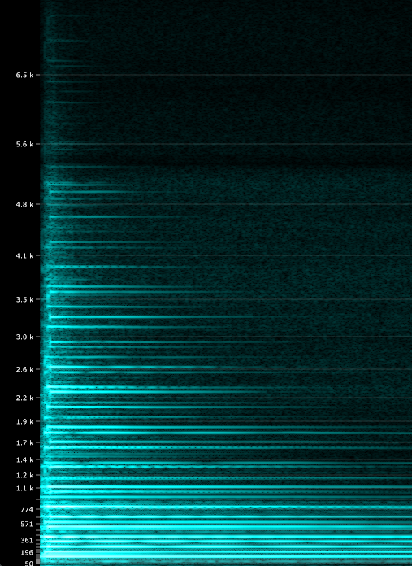
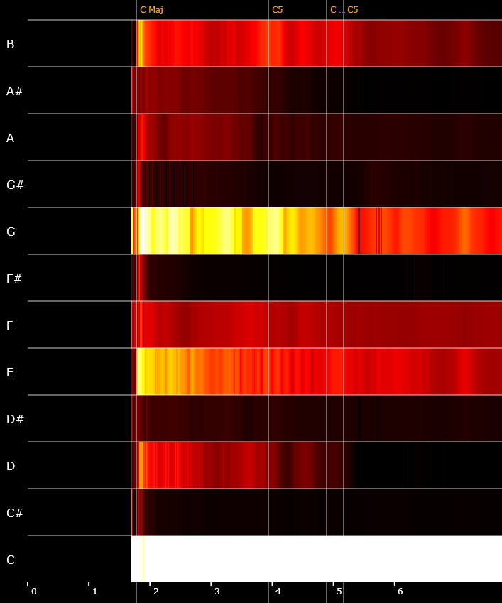

# ACR — Automatic Chord Recognition

ACR is a desktop application for real-time chord recognition and fretboard visualization, built in C++ with the [JUCE](https://juce.com/) framework.

It was developed as part of a Bachelor's thesis investigating the accuracy of two chromagram extraction methods — **Harmonic Pitch Class Profiles (HPCP)** and **Deep Chroma Learning (madmom DNN)** — with a particular focus on their performance on **distorted electric guitar signals**.

Beyond the research component, the application serves as a practical tool: it analyzes backing tracks, identifies chord progressions, and visualizes chord tones on a guitar fretboard in real time to support improvisation practice.

---

## Features

### Dual-Mode Interface

The application is split into two views, switchable via tabs:

**Instrument view** — the primary mode for playing along with a track.

<!-- TODO: Screenshot of Performance View -->
https://github.com/user-attachments/assets/33f0dd74-2a0f-4c5f-82a2-4f8ae0a2fa25

- Interactive guitar fretboard displaying all chord tone positions
- Color-coded by interval (root, third, fifth)
- "Now Playing" and "Up Next" chord display panel
- Updates in real time with the audio playback position

**Analysis View** — a scientific mode for inspecting the DSP pipeline output.

<!-- TODO: Screenshot of Analysis View -->


- High-resolution spectrogram (STFT) with frequency axis labels
- Chromagram with labeled chord segments
- Both visualizations are clickable and open in a full-size popup window
- Chromagram visualizes playhead of audio during playback (pause with space)
- Configurable analysis parameters (FFT size, hop size, similarity threshold, etc.)

| Full Spectogram | Full Chromagram |
| :---: | :---: |
|  |  |
---

### Audio Engine

- Record audio directly from your interface
- Load `.wav` or `.mp3` files for analysis and playback
- Transport controls: Play / Pause / Stop / Record
- Waveform display (always visible across both modes)

<!-- TODO: Screenshot or short video of transport bar + waveform -->

---

### Chord Analysis Pipeline

Two algorithms are available for chromagram extraction:

| | HPCP (Classical DSP) | Deep Chroma (DNN) |
|---|---|---|
| FFT Size | 4096 | 8192 |
| Hop Size | 512 (~86 fps) | 4410 (10 fps) |
| Approach | Harmonic Pitch Class Profiles (Gomez) | madmom-trained neural network via ONNX |
| Strengths | High temporal resolution | More robust against harmonics and noise |

Both feed into the same classification stage (cosine similarity against binary chord templates) and produce a timeline of chord segments.

---

### Guitar Fretboard Visualization

- 22 frets with realistic spacing (12-TET proportional layout)
- 6 strings with visual differentiation (plain steel vs. wound)
- Standard fret markers (dots at 3, 5, 7, 9, 12, 15, 17, 19, 21)
- Chord tones rendered as labeled ellipses on the correct string/fret positions

---

### Testing & Evaluation

A decoupled offline testing module for batch-processing audio datasets:

- Compares frame-level classifications against ground truth label files
- Exports aggregated accuracy metrics as JSON for evaluation in Python
- Used to benchmark HPCP vs. Deep Chroma accuracy across the test corpus

<!-- TODO: Example output table or chart from evaluation -->

---

## Setup & Installation

### Prerequisites

- C++17 compiler (MSVC on Windows, Clang on macOS, GCC on Linux)
- [CMake](https://cmake.org/download/) 3.22 or higher
- [ONNX Runtime](https://onnxruntime.ai/) (for Deep Chroma inference)

### Build

```bash
git clone git@github.com:Driemtax/ACR.git
cd ACR
mkdir build && cd build
cmake ..
cmake --build . --config Release
```

By default, CMake will fetch JUCE 0.0.12 via FetchContent. The ONNX Runtime path is currently hardcoded in `CMakeLists.txt` since it is platform dependent - so you'll need to adjust it to match your local installation:
```bash
target_include_directories(ACR PRIVATE "C:/Path/To/onnxruntime/include")
target_link_directories(ACR PRIVATE "C:/Path/To/onnxruntime/lib")
```

### Runtime Dependencies

The Deep Chroma model requires the ONNX Runtime DLL to be accessible at runtime (either in PATH or next to the executable).

---

## Project Context

This application was developed as part of a Bachelor's thesis at DHBW Mannheim. The thesis investigates whether Deep Chroma Learning (as proposed by Korzeniowski & Widmer, based on the madmom framework) yields higher chord recognition accuracy than the classical HPCP approach — specifically on audio material containing heavily distorted electric guitar.

The full thesis text will be made available in this repository upon completion.

## License
TODO: Add license information here
