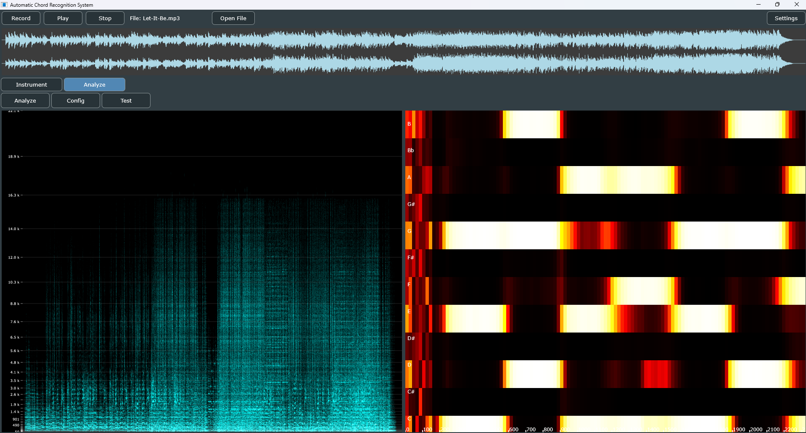
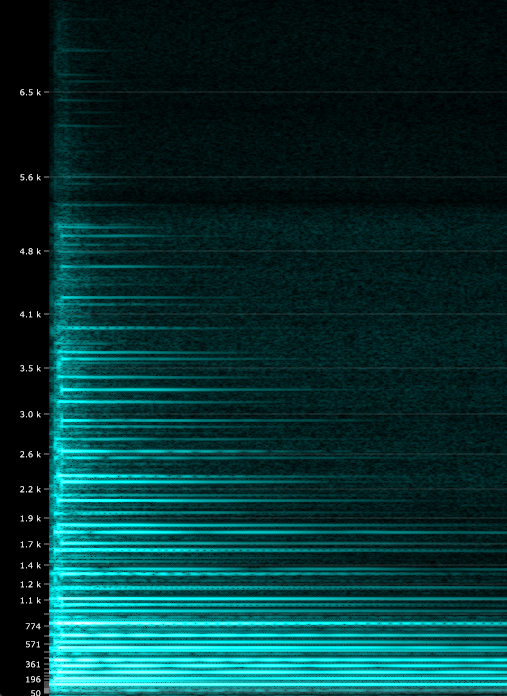
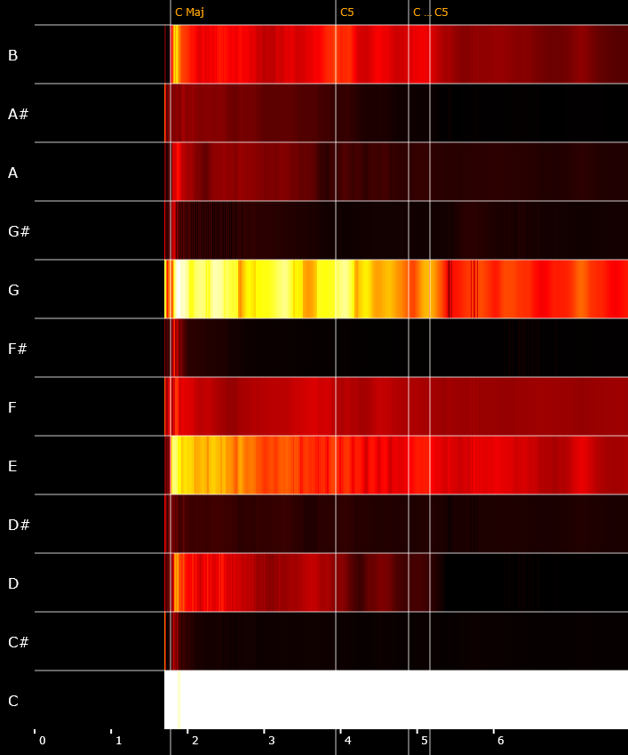

# ACR — Automatic Chord Recognition

ACR is a desktop application for automatic chord recognition and real-time fretboard visualization, built in C++ with the [JUCE](https://juce.com/) framework.

It was developed as part of a Bachelor's thesis investigating the accuracy of two chromagram extraction methods — **Harmonic Pitch Class Profiles (HPCP)** and **Deep Chroma Learning (madmom DNN)** — with a particular focus on their performance on **distorted electric guitar signals**.

Beyond the research component, the application serves as a practical tool: it analyzes backing tracks, identifies chord progressions, estimates the key, and visualizes chord tones and a matching scale on a guitar fretboard in real time to support improvisation practice.

Chord recognition runs offline on the complete audio file. During playback, the precomputed chord timeline is synchronized with the playback position.

---

## Features

### Dual-Mode Interface

The application is split into two views, switchable via tabs:

**Instrument view** — the primary mode for playing along with a track.

<!-- TODO: Screenshot of Performance View -->
https://github.com/user-attachments/assets/33f0dd74-2a0f-4c5f-82a2-4f8ae0a2fa25

- Guitar fretboard displaying all chord tone positions, labeled with their note names
- Preview of the next chord directly on the fretboard; positions shared by the current and the next chord are shown as split labels
- Color-coded by role: current chord (green), next chord (pale orange), scale (steel blue)
- Scale overlay: the estimated key preselects a major or minor pentatonic scale, which can be changed with the key and scale selector
- "Now Playing" and "Up Next" chord display panel
- Updates in real time with the audio playback position (chords are looked up in the precomputed analysis timeline)

**Analysis View** — a scientific mode for inspecting the DSP pipeline output.

<!-- TODO: Screenshot of Analysis View -->


- High-resolution spectrogram (STFT) with frequency axis labels
- Chromagram with labeled chord segments
- Both visualizations are clickable and open in a full-size popup window
- Chromagram visualizes playhead of audio during playback (pause with space)
- Configurable analysis parameters in the **Config** window:
  - Algorithm: HPCP or Deep Chroma
  - FFT size, hop size, similarity threshold
  - HPCP: harmonic weighting `s`, temporal median filter (on/off and window size), tuning shift with chroma resolution (12, 24 or 36 bins)
  - Key estimation (on/off) with Krumhansl-Kessler or Temperley key profiles
  - In Deep Chroma mode, the settings required by the model are applied automatically and the HPCP-only parameters are locked
- **Test** button to start the offline evaluation (see [Testing & Evaluation](#testing--evaluation))

| Full Spectogram | Full Chromagram |
| :---: | :---: |
|  |  |
---

### Audio Engine

- Record audio directly from your interface; recordings are saved to `Documents/ACR_App/recording.wav` and overwritten by the next recording
- Recordings are played back with a 6× gain boost, since direct interface recordings tend to be quiet
- Load `.wav` or `.mp3` files for analysis and playback
- Transport controls: Play / Pause / Stop / Record
- Audio device selection (input/output device, sample rate, buffer size) via the **Settings** button
- Waveform display (always visible across both modes)

<!-- TODO: Screenshot or short video of transport bar + waveform -->

---

### Chord Analysis Pipeline

Two algorithms are available for chromagram extraction:

| | HPCP (Classical DSP) | Deep Chroma (DNN) |
|---|---|---|
| FFT Size | 4096 | 8192 |
| Hop Size | 512 (~86 fps) | 4410 (10 fps) |
| Approach | Harmonic Pitch Class Profiles (Gomez) | madmom-trained neural network via ONNX |
| Strengths | High temporal resolution | More robust against harmonics and noise |
| Audio normalization | Yes | No (the model expects raw magnitudes) |
| Default similarity threshold | 0.3 | 0.7 |
| Key weighting (default) | Off | On |

Every analysis runs on the complete audio file in a background thread:

1. **Decoding & resampling**: the file is decoded, resampled to 44.1 kHz and mixed down to mono.
2. **Spectrogram**: Short-Time Fourier Transform with a Hann window.
3. **Chroma extraction**, either
   - **HPCP**: spectral peaks between ~100 Hz and 5 kHz are mapped to pitch classes, including up to 8 harmonics weighted by `s`; optional tuning shift and temporal median filter, or
   - **Deep Chroma**: the spectrum is compressed with madmom's logarithmic filterbank and passed to the ONNX model with a context of 15 frames.
4. **Key estimation**: the key of the track is estimated by correlating the chromagram with Krumhansl-Kessler or Temperley key profiles. Optionally, the chromagram is weighted with the profile of the estimated key.
5. **Classification**: both methods feed into the same classification stage, which uses cosine similarity against 36 binary chord templates (major, minor and power chord for each of the 12 roots). Frames that don't reach the similarity threshold are labeled as "no chord". Other chord types (7th, sus, diminished, …) are not recognized.
6. **Segmentation**: a new chord is only accepted once it has been detected for at least 10 consecutive frames (≈116 ms with HPCP, 1 s with Deep Chroma). The result is a timeline of chord segments.

Resampling, the STFT and the rendering of the spectrogram and chromagram are multithreaded.

Detailed notes on the individual pipeline stages can be found in [Docs/](Docs/).

---

### Guitar Fretboard Visualization

- 22 frets with realistic spacing (12-TET proportional layout)
- 6 strings in standard tuning (E A D G B E) with visual differentiation (plain steel vs. wound)
- Standard fret markers (dots at 3, 5, 7, 9, 12, 15, 17, 19, 21)
- Chord tones rendered as labeled ellipses on the correct string/fret positions
- Three label layers: current chord, next chord and scale (major or minor pentatonic)

---

### Testing & Evaluation

A decoupled offline testing module for batch-processing audio datasets:

- Compares frame-level classifications against ground truth label files
- Exports aggregated accuracy metrics as JSON for evaluation in Python
- Used to benchmark HPCP vs. Deep Chroma accuracy across the test corpus
- Parameter sweeps (similarity threshold, `s`, median window size, combined `s` × threshold grid) to find the best configuration

<!-- TODO: Example output table or chart from evaluation -->

**Running the evaluation**

1. Put the dataset into `Testfiles/` in the project root (not included in this repository). The `.wav` files can be placed directly in `Testfiles/` or in a subfolder per test case. Each `<name>.wav` needs a `<name>_label.txt`, which must always be in the `Testfiles/` root. Each line of a label file holds a chord onset in seconds and the chord name; a chord lasts until the next onset:
   ```
   0.023219955,A Maj
   3.793560091,D Maj
   ```
   Chord names must exactly match the classifier's names: `<Root> Maj`, `<Root> Min` or `<Root>5`, using sharps (`C#`, not `Db`).
2. Select the test cases and parameter sweeps in `Test::runAllTests()` (`Source/TestSetup/Test.cpp`) by commenting them in or out.
3. Click **Test** in the Analysis View. The results are written to `TestResults/ThesisTests/results_<testName>.json` and contain the overall accuracy as well as per-track and frame-level results.

The test module locates `Testfiles/` relative to the executable, so the binary has to stay at `<build dir>/ACR_artefacts/<Config>/ACR.exe`.

**Python scripts**

`Scripts/` contains Python tools for the evaluation and for porting the Deep Chroma model. They require Python 3.9.13, because madmom's dependencies don't install on newer versions (see [Scripts/README.md](Scripts/README.md)):

- `generate_filterbank.py`: extracts the weights of madmom's logarithmic filterbank (used in `Source/ML/FilterbankWeights.h`)
- `verification.py`: compares a chromagram exported by ACR with the output of madmom's `DeepChromaProcessor` (86.11 % agreement at a tolerance of 1e-4). To export a chromagram, set `exportForPython = true` in `ChordAnalyzer::runAnalysis`; the JSON file is written to the desktop.
- `plot_*.py`: charts of the evaluation results

---

## Setup & Installation

### Prerequisites

- C++17 compiler: currently MSVC on Windows (Clang on macOS or GCC on Linux need adjustments, see below)
- [CMake](https://cmake.org/download/) 3.22 or higher
- [ONNX Runtime](https://onnxruntime.ai/) (for Deep Chroma inference; developed against version 1.26.0)
- The Deep Chroma model as an ONNX file (`deep_chroma.onnx`, not included in this repository)
- Optional: Python 3.9.13 for the scripts in `Scripts/`

### Build

```bash
git clone git@github.com:Driemtax/ACR.git
cd ACR
mkdir build && cd build
cmake ..
cmake --build . --config Release
```

By default, CMake will fetch JUCE 8.0.12 via FetchContent. The ONNX Runtime path is currently hardcoded in `CMakeLists.txt` since it is platform dependent - so you'll need to adjust it to match your local installation:
```bash
target_include_directories(ACR PRIVATE "C:/Path/To/onnxruntime/include")
target_link_directories(ACR PRIVATE "C:/Path/To/onnxruntime/lib")
```

The same path is also used in `compile_flags.txt` (only needed for clangd). The path to the Deep Chroma model is hardcoded in `Source/ML/DeepChromaExtractor.h`:
```cpp
const wchar_t *modelPath = L"C:\\Path\\To\\deep_chroma.onnx";
```

The wide-string model path and the linking against `onnxruntime.lib` are Windows-specific, so building on macOS or Linux currently requires adapting them.

On Windows, `build.bat` configures the project into `cmake-build/`, builds the Debug configuration and starts the application. Debug builds open an additional console window that shows log output (e.g. the timing of the analysis steps).

### Runtime Dependencies

The Deep Chroma model requires the ONNX Runtime DLL to be accessible at runtime (either in PATH or next to the executable). The model file `deep_chroma.onnx` must exist at the path configured in `DeepChromaExtractor.h` before a Deep Chroma analysis is started.

---

## Project Context

This application was developed as part of a Bachelor's thesis at DHBW Mannheim. The thesis investigates whether Deep Chroma Learning (as proposed by Korzeniowski & Widmer, based on the madmom framework) yields higher chord recognition accuracy than the classical HPCP approach — specifically on audio material containing heavily distorted electric guitar.

The full thesis text will be made available in this repository upon completion.

## License
This project is licensed under the [MIT License](LICENSE).
